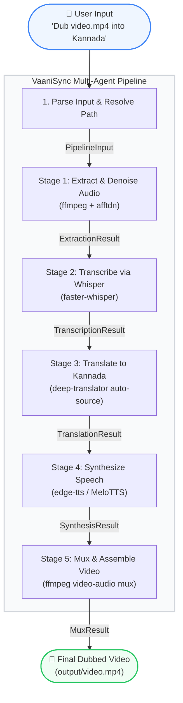

# 🎬 VaaniSync: Offline Multi-Agent Video Localizer & Dubber (Kannada)

[](https://www.kaggle.com)
[](https://github.com/google/ai-edge)
[](#)

Submitted for the **AI Agents: Intensive Vibe Coding Capstone Project** under the **Agents for Good** track.

---

## 📖 Project Overview & Story

### The Problem
Educational, informational, and business videos online are overwhelmingly created in English. For millions of regional language speakers (such as Kannada speakers in India), this creates a massive knowledge and accessibility barrier. Existing automated dubbing solutions suffer from three core issues:
1. **Cloud Dependence & Cost**: Relying on expensive cloud APIs that charge per minute and expose private media.
2. **Robotic Pacing**: Simply translating sentences and synthesizing them creates voice tracks that either overlap or run out of sync with the video timeline.
3. **Gender/Voice Mismatch**: Generic TTS pipelines apply a single default voice, stripping away the natural gender variations of the original speakers.

### The Solution: VaaniSync
**VaaniSync** is a fully local, offline-first multi-agent pipeline designed to ingest any video, transcribe the speech, translate it to natural conversational Kannada, synthesize gender-appropriate neural voices, and dynamically time-stretch/align the audio to the original video frames. 

By running entirely on local CPU resources, VaaniSync makes localization free, secure, and accessible to educators, content creators, and businesses alike.

---

## 🛠️ System Architecture

Built using the **Google Agent Development Kit (ADK) 2.0 Graph Workflow API**, the project enforces a highly structured, type-safe sequential multi-agent graph where state is managed contextually and nodes communicate via defined Pydantic schemas.



### Type-Safe Data Contracts (Pydantic)
Each edge in our workflow graph is strictly validated to ensure data integrity across stages:
* **`PipelineInput`**: Validates input video path, target language, and requested voice gender.
* **`ExtractionResult`**: Outputs validated paths for the original video and extracted audio.
* **`TranscriptionResult`**: Contains the transcription filepath, segment count, and auto-detected source language.
* **`TranslationResult`**: Tracks the path of translated Kannada segments.
* **`SynthesisResult`**: Stores directory references for individual speed-aligned WAV files.
* **`MuxResult`**: The final product path in the `output/` directory.

---

## 🌟 Key Capstone Implementations & Course Concepts

### 1. Multi-Agent Design & Workflow Graph
The orchestration is built using `google.adk.workflow.Workflow` in [video_localizer/agent.py](file:///c:/Users/bhara/Desktop/Antigravity/lang-to-lang/video_localizer/agent.py). It registers multiple function nodes with discrete responsibilities and custom `RetryConfig` policies to handle transient hardware hiccups (e.g., CPU memory peaks during transcription).

### 2. Smart Pacing & Dynamic Time-Stretching
To prevent dubbed speech from running out of sync:
* **Speed Stretching**: If the synthesized Kannada audio is longer than the original English spoken segment, VaaniSync calculates the ratio and applies FFmpeg's `atempo` filter to speed up the audio (up to 2.0x) without altering the voice pitch.
* **Silence Padding**: If the synthesized audio is shorter than the segment window, the agent calculates the offset and appends exact milliseconds of digital silence using `pydub` to preserve alignment.

### 3. Context-Aware Batch Translation
Instead of translating subtitles line-by-line (which ruins context), VaaniSync batches the transcription segments, passing them together to maintain sentence-level grammatical flow (Subject-Object-Verb ordering in Kannada vs Subject-Verb-Object in English).

---

## 📂 Project Structure

```text
lang-to-lang/
├── video_localizer/
│   ├── agent.py                  # Main ADK Workflow definition & node logic
│   └── agents/
│       ├── __init__.py
│       └── translation.py        # Independent translation agent module
├── tests/
│   ├── test_pipeline.py          # 100% Mocked Pytest suite (Ollama/FFmpeg mocked)
│   └── eval/
│       ├── eval_config.yaml
│       └── eval_dataset.json
├── information/
│   └── workflow_graph.md         # Detailed pipeline diagram and documentation
├── skill/
│   └── SKILL.md                  # ADK Custom agent skill definition
├── run_dubbing.bat               # Easy drag-and-drop launcher script
├── requirements.txt              # Pipeline dependencies
└── CAPSTONE_README.md            # This Kaggle Capstone document
```

---

## 🚀 Setup & Installation

VaaniSync is designed to run entirely locally. Ensure you have **FFmpeg** installed on your system.

### 1. Prerequisites
```powershell
# On Windows via Winget:
winget install ffmpeg
```

### 2. Installation
```powershell
# Clone the repository, navigate in, and set up a venv
python -m venv .venv
.\.venv\Scripts\activate.ps1

# Install requirements
pip install -r requirements.txt
```

### 3. Local Verification
We maintain high code quality with automated unit tests and strict linting. Check correctness:
```powershell
# Run the complete test suite (all heavy models are mocked)
pytest tests/test_pipeline.py -v

# Run linting checks
ruff check video_localizer/ tests/
```

---

## 🎬 How to Run

### Option A: Drag-and-Drop Launcher (Windows)
We provided an interactive batch script [run_dubbing.bat](file:///c:/Users/bhara/Desktop/Antigravity/lang-to-lang/run_dubbing.bat):
1. Simply drag any video file from your file explorer and drop it onto `run_dubbing.bat`.
2. The script activates the virtual environment and kicks off the ADK pipeline.

### Option B: Interactive Web UI
You can start the visual web interface provided by Google ADK to watch the agent states trigger:
```powershell
.\.venv\Scripts\adk.exe web video_localizer --port 8001
```
Open **http://127.0.0.1:8001** and prompt the agent:
> *"Convert the audio of video/video1.mp4 to Kannada"*

### Option C: CLI
```powershell
.\.venv\Scripts\adk.exe run video_localizer "Convert the audio of video/video1.mp4 to Kannada"
```

---

## 🎯 Track Evaluation Details

* **Agents for Good Alignment**: Empowers local communities by translating high-quality educational and technology materials into Kannada automatically and completely offline, removing the financial gatekeeping of cloud translation fees.
* **Effective Use of Agent Technologies**: Showcases advanced workflow patterns from the course including sequential graphs, state preservation via Context, retry logic, and fallback translation hooks.
* **Communication & Documentation**: Includes interactive runtime logs, clean diagrams, and robust error-catching (e.g. failing gracefully back to original text if synthesis fails).

---

## 🔒 Security & Privacy

VaaniSync is designed with a **privacy-first, local-first** architecture:
* **Zero Video Leakage**: All video file manipulation, original audio extraction, and final muxing are performed locally on your machine via standard local commands (`ffmpeg` / `pydub`). No video/audio files are uploaded to third-party servers.
* **Offline Speech & Translation Options**: 
  * Transcription is handled locally using `faster-whisper` running directly on your CPU.
  * For translation and speech synthesis: To achieve 100% offline security, configure translation to run entirely through your local Ollama LLM (`gemma2:2b`), and configure text-to-speech to use local `MeloTTS` exclusively, bypassing any external APIs.
  * By default, `edge-tts` is used as a high-quality fallback and communicates with public Edge TTS endpoints over TLS/HTTPS without saving audio files or request metadata.

---

## 🌍 Setting Up Other Local Languages

To adapt VaaniSync for any other local language (e.g. Hindi, Spanish, Tamil, Telugu), follow this simple setup mapping guide:

### 1. Configure Translation Target
In [video_localizer/agent.py](file:///c:/Users/bhara/Desktop/Antigravity/lang-to-lang/video_localizer/agent.py#L95-L117), modify the target code inside `_translate_batch`:
```python
# Change "kn" to "hi" (Hindi), "te" (Telugu), "es" (Spanish), etc.
translator = GoogleTranslator(source="auto", target="hi")
```

### 2. Configure TTS Voices
In [video_localizer/agent.py](file:///c:/Users/bhara/Desktop/Antigravity/lang-to-lang/video_localizer/agent.py#L407-L508), map the target language codes to supported voices in `edge-tts` and `MeloTTS`:
* **Hindi (hi)**:
  * Edge Female: `hi-IN-SwararaNeural` | Edge Male: `hi-IN-MadhurNeural`
* **Telugu (te)**:
  * Edge Female: `te-IN-ShrutiNeural` | Edge Male: `te-IN-MohanNeural`
* **Spanish (es)**:
  * Edge Female: `es-ES-ElviraNeural` | Edge Male: `es-ES-AlvaroNeural`
  * MeloTTS language code: `ES`

```python
# In synthesise_segments, update voice constants:
edge_voice_female = "hi-IN-SwararaNeural"
edge_voice_male = "hi-IN-MadhurNeural"
# Also update the MeloTTS config code if using MeloTTS:
melo_tts = TTS(language="HI", device="cpu")
```

### 3. Update default arguments
Update the default properties in [PipelineInput](file:///c:/Users/bhara/Desktop/Antigravity/lang-to-lang/video_localizer/agent.py#L34-L40):
```python
class PipelineInput(BaseModel):
    video_path: str = "video/video1.mp4"
    target_language: str = "Hindi"  # <-- Update this default
    speaker_gender: str = "male"
```

---

## 🚀 Future Scope

* **Multilingual Dynamic Voice Mapping**: Implement a dynamic configuration file or database that resolves detected/target languages directly to matching local voice profiles, eliminating manual code modification.
* **Speaker Diarization**: Integrate a local speaker identification model (such as `pyannote.audio`) to isolate different speaker voices in a single video, applying distinct gendered/styled TTS voices to matching speakers.
* **Interactive UI controls**: Build an advanced frontend settings pane within the ADK Web interface to allow users to upload videos, select target languages, toggle voice profiles, and export subtitles on the fly.
* **Auto-Subtitling (SRT/VTT)**: Dynamically generate and burn subtitles into the final muxed video output alongside the audio track.
