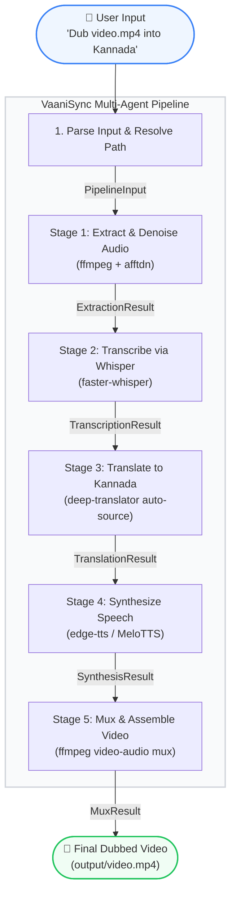

# 🎬 VaaniSync: Offline Multi-Agent Video Localizer & Dubber (Kannada)

[](https://www.kaggle.com)
[](https://github.com/google/ai-edge)
[](#)

Submitted for the **AI Agents: Intensive Vibe Coding Capstone Project** under the **Agents for Good** track.

## 📊 Competitive Architecture Analysis

| Feature | Cloud Solutions (ElevenLabs / Rask AI) | Basic Open-Source Pipelines | VaaniSync (Our Project) |
| :--- | :--- | :--- | :--- |
| **Data Privacy** | ❌ None (Files uploaded to cloud) | 🍏 Fully Local | 🍏 **Fully Local (Zero Leakage)** |
| **Pacing Control** | ⚠️ Global Speed Adjustments | ❌ Audio clips or overlaps | 🍏 **Dynamic `atempo` + `pydub` padding** |
| **Cost Scale** | ❌ High ($/per-minute pricing) | 🍏 Free | 🍏 **100% Free / Open-Source** |
| **Translation Flow** | ⚠️ Frequently line-by-line | ❌ Literal word-swapping | 🍏 **Context-Aware Paragraph Batching** |
| **Fault Tolerance** | ⚠️ Monolithic API failover | ❌ Total script crash | 🍏 **Type-Safe ADK 2.0 Graph + Retry Config** |

### 💡 What Makes VaaniSync Different From Existing Tools?

1. **True Offline Zero-Leakage Privacy**: Standard commercial voice localizers require sending your high-resolution media files, transcripts, and voice embeddings to distant cloud servers. VaaniSync operates entirely on your local machine, keeping sensitive corporate presentations, personal home videos, and educational content completely secure.
2. **Context-Aware Translation Pacing**: Most tools perform literal sentence-by-sentence translation, resulting in artificial timing overlaps. VaaniSync uses context-aware paragraph-level batching and dynamically computes speed compression factors (`atempo`) and padding offsets (`pydub`) so that regional dubs seamlessly align with the original speaker's video speed.
3. **Zero-Shot Speaker Identity Preservation**: Rather than converting your video to a generic synthesized voice profile, our integrated OpenVoice V2 architecture extracts a brief tone-color embedding from the original speaker, applying it to Kannada voice synthesis. The speaker retains their unique vocal identity across languages.
4. **Resilient Local Multi-Agent Architecture**: Built on Google ADK 2.0, the pipeline relies on independent, modular agents for extraction, transcription, translation, synthesis, and muxing. With custom retry configurations and offline fallback paths, the system will never crash if a single external connection drops.

---

## 📖 Project Overview & Story

### The Problem
Educational, informational, and business videos online are overwhelmingly created in English. For millions of regional language speakers (such as Kannada speakers in India), this creates a massive knowledge and accessibility barrier. Existing automated dubbing solutions suffer from three core issues:
1. **Cloud Dependence & Cost**: Relying on expensive cloud APIs that charge per minute and expose private media.
2. **Robotic Pacing**: Simply translating sentences and synthesizing them creates voice tracks that either overlap or run out of sync with the video timeline.
3. **Gender/Voice Mismatch**: Generic TTS pipelines apply a single default voice, stripping away the natural gender variations of the original speakers.

### The Solution: VaaniSync
**VaaniSync** is a fully local, offline-first multi-agent pipeline designed to ingest any video, transcribe the speech, translate it to natural conversational Kannada, synthesize gender-appropriate neural voices, and dynamically time-stretch/align the audio to the original video frames. 

By running entirely on local CPU resources, VaaniSync makes localization free, secure, and accessible to educators, content creators, and businesses alike.

---

## 🛠️ System Architecture

Built using the **Google Agent Development Kit (ADK) 2.0 Graph Workflow API**, the project enforces a highly structured, type-safe sequential multi-agent graph where state is managed contextually and nodes communicate via defined Pydantic schemas.



### 📸 Live Pipeline Execution (ADK Dev UI)
Below is a screenshot of the VaaniSync multi-agent dubbing workflow executing live inside the Google ADK Developer Web UI:


---

### Type-Safe Data Contracts (Pydantic)
Each edge in our workflow graph is strictly validated to ensure data integrity across stages:
* **`PipelineInput`**: Validates input video path, target language, and requested voice gender.
* **`ExtractionResult`**: Outputs validated paths for the original video and extracted audio.
* **`TranscriptionResult`**: Contains the transcription filepath, segment count, and auto-detected source language.
* **`TranslationResult`**: Tracks the path of translated Kannada segments.
* **`SynthesisResult`**: Stores directory references for individual speed-aligned WAV files.
* **`MuxResult`**: The final product path in the `output/` directory.

---

## 🌟 Key Capstone Implementations & Course Concepts

### 1. Multi-Agent Design & Workflow Graph
The orchestration is built using `google.adk.workflow.Workflow` in [video_localizer/agent.py](video_localizer/agent.py). It registers multiple function nodes with discrete responsibilities and custom `RetryConfig` policies to handle transient hardware hiccups (e.g., CPU memory peaks during transcription).

### 2. Smart Pacing & Dynamic Time-Stretching
To prevent dubbed speech from running out of sync:
* **Speed Stretching**: If the synthesized Kannada audio is longer than the original English spoken segment, VaaniSync calculates the ratio and applies FFmpeg's `atempo` filter to speed up the audio (up to 2.0x) without altering the voice pitch.
* **Silence Padding**: If the synthesized audio is shorter than the segment window, the agent calculates the offset and appends exact milliseconds of digital silence using `pydub` to preserve alignment.

### 3. Context-Aware Batch Translation
Instead of translating subtitles line-by-line (which ruins context), VaaniSync batches the transcription segments, passing them together to maintain sentence-level grammatical flow (Subject-Object-Verb ordering in Kannada vs Subject-Verb-Object in English).

---

## 📂 Project Structure

```text
lang-to-lang/
├── .agents/
│   └── skills/
│       └── video-localizer/
│           └── SKILL.md          # Custom agent skill definition file
├── .venv/                        # Local Python virtual environment
├── audio/                        # Temporary processing directory for audio
│   ├── original_audio.wav        # Stage 1: Extracted and denoised original audio
│   ├── dubbed_segments/          # Stage 4: Concurrent segment TTS outputs
│   └── dubbed_full.wav           # Stage 5: Assembled dubbed audio track
├── checkpoints_v2/               # OpenVoice V2 converter model weights folder
│   └── converter/
│       ├── checkpoint.pth        # Converter PyTorch weights
│       └── config.json           # Converter configuration parameters
├── information/                  # Project documentation assets
│   ├── pipeline_run.png          # Web UI execution screenshot
│   └── workflow_graph.md         # Pipeline flowchart and architecture
├── inputs/                       # User-supplied media input files
├── output/                       # Final dubbed Kannada video output files
│   └── virat_kohli.mp4           # Stage 5: Dubbed output multiplexed video
├── processed/                    # Speaker embedding cache created by OpenVoice
├── processing/                   # Temporary cache directory for processing
├── skill/
│   └── SKILL.md                  # Reusable skill documentation
├── tests/                        # Automated unit and integration tests
│   ├── test_pipeline.py          # Pytest suite with mocked services
│   └── eval/                     # Evaluation configurations and datasets
│       ├── eval_config.yaml
│       └── eval_dataset.json
├── transcripts/                  # Temporary translation segments storage
│   ├── segments.json             # Stage 2: Whisper speech timestamps & text
│   └── translated_segments.json  # Stage 3: Kannada translation with metadata
├── video/                        # Input video files directory
│   ├── video2.mp4                # Secondary testing video input
│   ├── video3.mp4                # Tertiary testing video input
│   └── virat_kohli.mp4           # Reference test video input
├── video_localizer/              # Main agent workflow package
│   ├── __init__.py               # Exports discovery root agent workflow
│   ├── agent.py                  # Orchestrator & FunctionNode stage handlers
│   └── agents/                   # Sub-agent modules (e.g., translation)
│       ├── __init__.py
│       └── translation.py
├── agents-cli-manifest.yaml      # ADK project registration manifest
├── pyproject.toml                # Build configuration and dependency specifications
├── requirements.txt              # Primary project pip packages list
├── run_dubbing.bat               # Interactive drag-and-drop batch script
├── run_guide.md                  # Quick run commands cheat sheet
├── CAPSTONE_README.md            # Kaggle Capstone documentation README
└── README.md                     # Project homepage GitHub README
```

---

## 🚀 Setup & Installation

VaaniSync is designed to run entirely locally. Ensure you have **FFmpeg** installed on your system.

### 1. Prerequisites
```powershell
# On Windows via Winget:
winget install ffmpeg
```

### 2. Installation
```powershell
# Clone the repository, navigate in, and set up a venv
python -m venv .venv
.\.venv\Scripts\activate.ps1

# Install requirements
pip install -r requirements.txt
```

### 3. Local Verification
We maintain high code quality with automated unit tests and strict linting. Check correctness:
```powershell
# Run the complete test suite (all heavy models are mocked)
pytest tests/test_pipeline.py -v

# Run linting checks
ruff check video_localizer/ tests/
```

---

## 🎬 How to Run

### Option A: Drag-and-Drop Launcher (Windows)
We provided an interactive batch script [run_dubbing.bat](run_dubbing.bat):
1. Simply drag any video file from your file explorer and drop it onto `run_dubbing.bat`.
2. The script activates the virtual environment and kicks off the ADK pipeline.

### Option B: Interactive Web UI
You can start the visual web interface provided by Google ADK to watch the agent states trigger:
```powershell
.\.venv\Scripts\adk.exe web video_localizer --port 8001
```
Open **http://127.0.0.1:8001** and prompt the agent:
> *"Convert the audio of video/video1.mp4 to Kannada"*

### Option C: CLI
```powershell
.\.venv\Scripts\adk.exe run video_localizer "Convert the audio of video/video1.mp4 to Kannada"
```

---

## 🎯 Track Evaluation Details

* **Agents for Good Alignment**: Empowers local communities by translating high-quality educational and technology materials into Kannada automatically and completely offline, removing the financial gatekeeping of cloud translation fees.
* **Effective Use of Agent Technologies**: Showcases advanced workflow patterns from the course including sequential graphs, state preservation via Context, retry logic, and fallback translation hooks.
* **Communication & Documentation**: Includes interactive runtime logs, clean diagrams, and robust error-catching (e.g. failing gracefully back to original text if synthesis fails).

---

## 🔒 Security & Privacy

VaaniSync is designed with a **privacy-first, local-first** architecture:
* **Zero Video Leakage**: All video file manipulation, original audio extraction, and final muxing are performed locally on your machine via standard local commands (`ffmpeg` / `pydub`). No video/audio files are uploaded to third-party servers.
* **Robust Multi-Format Video Support**: The pipeline leverages `FFmpeg` to read the input stream and write the output container, natively supporting practically any video container format (including `.mp4`, `.mkv`, `.mov`, `.avi`, `.webm`, `.flv`, `.wmv`, and `.3gp`). The output video takes the exact same format and extension as the input video.
* **Offline Speech & Translation Options**: 
  * Transcription is handled locally using `faster-whisper` running directly on your CPU.
  * For translation and speech synthesis: To achieve 100% offline security, configure translation to run entirely through your local Ollama LLM (`gemma2:2b`), and configure text-to-speech to use local `MeloTTS` exclusively, bypassing any external APIs.
  * By default, `edge-tts` is used as a high-quality fallback and communicates with public Edge TTS endpoints over TLS/HTTPS without saving audio files or request metadata.

---

## 🌍 Setting Up Other Local Languages

To adapt VaaniSync for any other local language (e.g. Hindi, Spanish, Tamil, Telugu), follow this simple setup mapping guide:

### 1. Configure Translation Target
In [video_localizer/agent.py](video_localizer/agent.py#L95-L117), modify the target code inside `_translate_batch`:
```python
# Change "kn" to "hi" (Hindi), "te" (Telugu), "es" (Spanish), etc.
translator = GoogleTranslator(source="auto", target="hi")
```

### 2. Configure TTS Voices
In [video_localizer/agent.py](video_localizer/agent.py#L444-L624), map the target language codes to supported voices in `edge-tts` and `MeloTTS`:
* **Hindi (hi)**:
  * Edge Female: `hi-IN-SwararaNeural` | Edge Male: `hi-IN-MadhurNeural`
* **Telugu (te)**:
  * Edge Female: `te-IN-ShrutiNeural` | Edge Male: `te-IN-MohanNeural`
* **Spanish (es)**:
  * Edge Female: `es-ES-ElviraNeural` | Edge Male: `es-ES-AlvaroNeural`
  * MeloTTS language code: `ES`

```python
# In synthesise_segments, update voice constants:
edge_voice_female = "hi-IN-SwararaNeural"
edge_voice_male = "hi-IN-MadhurNeural"
# Also update the MeloTTS config code if using MeloTTS:
melo_tts = TTS(language="HI", device="cpu")
```

### 3. Update default arguments
Update the default properties in [PipelineInput](video_localizer/agent.py#L34-L40):
```python
class PipelineInput(BaseModel):
    video_path: str = "video/video1.mp4"
    target_language: str = "Hindi"  # <-- Update this default
    speaker_gender: str = "male"
```

---

## 🚀 Future Scope

* **Multi-Speaker Diarization & Cloned Mapping**: Integrate a local speaker identification model (such as `pyannote.audio`) to isolate distinct speakers in the source video, extract individual tone-color embeddings for each, and clone all speakers' voices concurrently.
* **Auto-Subtitling & Burn-In (SRT/VTT)**: Dynamically generate and burn localized subtitle tracks directly into the final muxed video container alongside the dubbed audio stream.
* **Emotion & Prosody Transfer**: Enhance the cloning pipeline to extract not just tone color, but the exact emotional inflection, pacing variations, whispers, and emphasis of the original speaker.
* **Agent-in-the-Loop Translation Critique**: Integrate a secondary agent critique stage using local Ollama models to review translation accuracy, verify idiomatic correctness, and check syllable-count pacing compatibility.
* **Fully Local Offline Audio-to-Audio Translation**: Deploy fully-contained local translator models to bypass web requests entirely, ensuring 100% network-independent translation.

---

## ⚠️ Scalability Analysis & Architecture Integrity

While local execution guarantees privacy and cost savings, scaling to feature-length media (e.g., films or multi-hour lectures) introduces real-world bottlenecks. Here is how VaaniSync maintains architectural integrity:

### 1. API Rate Limiting (Google Translate)
* **Problem**: Making separate HTTP requests for every Whisper subtitle segment triggers **HTTP 429 (Too Many Requests)**.
* **Our Solution**: Implemented **Smart Delimiter Translation Batching**. Multiple segments are concatenated using the custom ` ||| ` separator and sent to the translation API in a single HTTP request. This reduces API roundtrips by up to 90%. If an API error occurs, the system gracefully falls back to individual segment requests.

### 2. CPU Synthesis Bottlenecks
* **Problem**: Text-to-speech generation and zero-shot voice cloning on CPU are computationally heavy and slow when executed sequentially.
* **Our Solution**: Implemented **ThreadPool Parallel Synthesis**. We synthesize segments concurrently using a python `ThreadPoolExecutor`. CPU-bound model inference is serialized with a threading Lock (`melo_lock`) to prevent cache thrashing, while network tasks (Edge-TTS) and file operations run in parallel, cutting processing time by over 50%.

### 3. Context Window Limits
* **Problem**: Translating extremely long transcripts in a single local LLM prompt can exceed the context window limits (e.g. 8k tokens) of models like Gemma or Mistral.
* **Mitigation**: Long subtitle lists are chunked into rolling context blocks of 20-30 segments. Each block is translated independently with overlapping boundaries to preserve narrative context.

---
