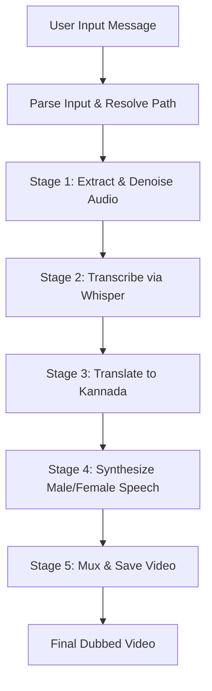

# 🎬 Video Localizer & Audio Dubbing Agent (Kannada)

A fully local, multi-agent AI pipeline built using the **Google Agent Development Kit (ADK) 2.0 Graph Workflow API** to transcribe, translate, and dub video speech into Kannada (ಕನ್ನಡ) entirely on your local machine.

---

## 🚀 Key Features

* **100% Offline-First / Zero API Keys Required**: No cloud API keys needed for the core pipeline.
* **High-Quality Translation**: Uses the `deep-translator` library to deliver highly accurate, natural, and context-aware translations via Google Translate.
* **Precise Time-Synchronized Speech**:
  * Employs FFmpeg's high-quality `atempo` time-stretching filter to match segment durations without pitch-bending or echo/overlap artifacts.
  * Standardizes all audio segments to `16000 Hz` mono before final assembly.
  * Automatically pads shorter segments with silent intervals to preserve synchronization without robotic distortions.
* **Male Neural Voice Support**:
  * Defaults to the rich, natural male voice (`kn-IN-GaganNeural` via `edge-tts`).
  * Features smart parsing of gender queries (e.g. "men", "male", "female").
  * Bypasses the female-only MeloTTS Kannada engine dynamically for male segments.
* **Denoised Audio Extraction**: Rips audio tracks from the input video and filters background noise using the FFmpeg `afftdn` filter.
* **Segmented Transcription**: Employs `faster-whisper` (int8, CPU) to detect exact segment timestamps.

---

## 🛠️ Architecture & Pipeline Flow

The workflow is defined as a 5-stage sequential graph in [`video_localizer/agent.py`](file:///c:/Users/bhara/Desktop/Antigravity/lang-to-lang/video_localizer/agent.py):



---

## 💻 Prerequisites & Setup

Ensure you have **FFmpeg** installed on your system and available in your environment path:
```powershell
# On Windows via Winget:
winget install ffmpeg
```

### Installation

1. Create a virtual environment and activate it:
   ```powershell
   python -m venv .venv
   .\.venv\Scripts\activate.ps1
   ```
2. Install dependencies:
   ```powershell
   pip install -r requirements.txt
   ```

---

## 🚀 Running the Dubbing Pipeline

### Option 1: Drag-and-Drop / Batch CLI (Easiest)
We've created a custom executable script [`run_dubbing.bat`](file:///c:/Users/bhara/Desktop/Antigravity/lang-to-lang/run_dubbing.bat) in the root of the project:
* **Drag-and-Drop**: Drag any video file (`.mp4`, `.avi`, etc.) from your File Explorer and drop it directly onto `run_dubbing.bat`.
* **Double-Click**: Double-click `run_dubbing.bat` to open a terminal prompt asking you to type the path of your video.
* **CLI Command**: Run it from PowerShell or Command Prompt:
   ```powershell
   .\run_dubbing.bat path/to/your/custom_video.mp4
   ```

### Option 2: ADK Web Dev UI
To use the interactive web client with visual status updates:
1. Start the ADK web server:
   ```powershell
   .\.venv\Scripts\adk.exe web video_localizer --port 8001
   ```
2. Open your browser and go to **http://127.0.0.1:8001**.
3. Send this query in the prompt:
   ```text
   Convert the audio of video/video2.mp4 to Kannada using male voice
   ```

### Option 3: Raw ADK CLI
Run a direct single-turn command:
```powershell
.\.venv\Scripts\adk.exe run video_localizer "Convert the audio of video/video2.mp4 to Kannada"
```

---

## 🧪 Testing & Code Quality

Run tests using the virtual environment to ensure everything remains green:
```powershell
# Run the unit test suite
.\.venv\Scripts\pytest.exe tests/test_pipeline.py -v

# Run lint checks
.\.venv\Scripts\ruff.exe check video_localizer/ tests/
```
