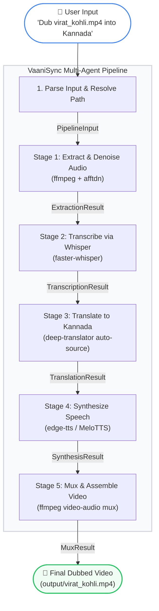
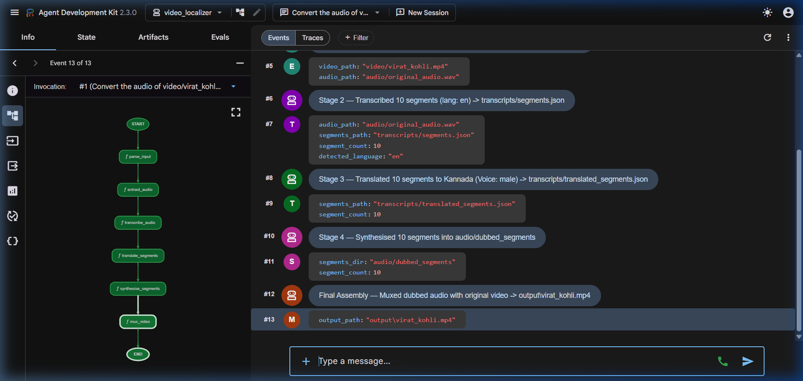
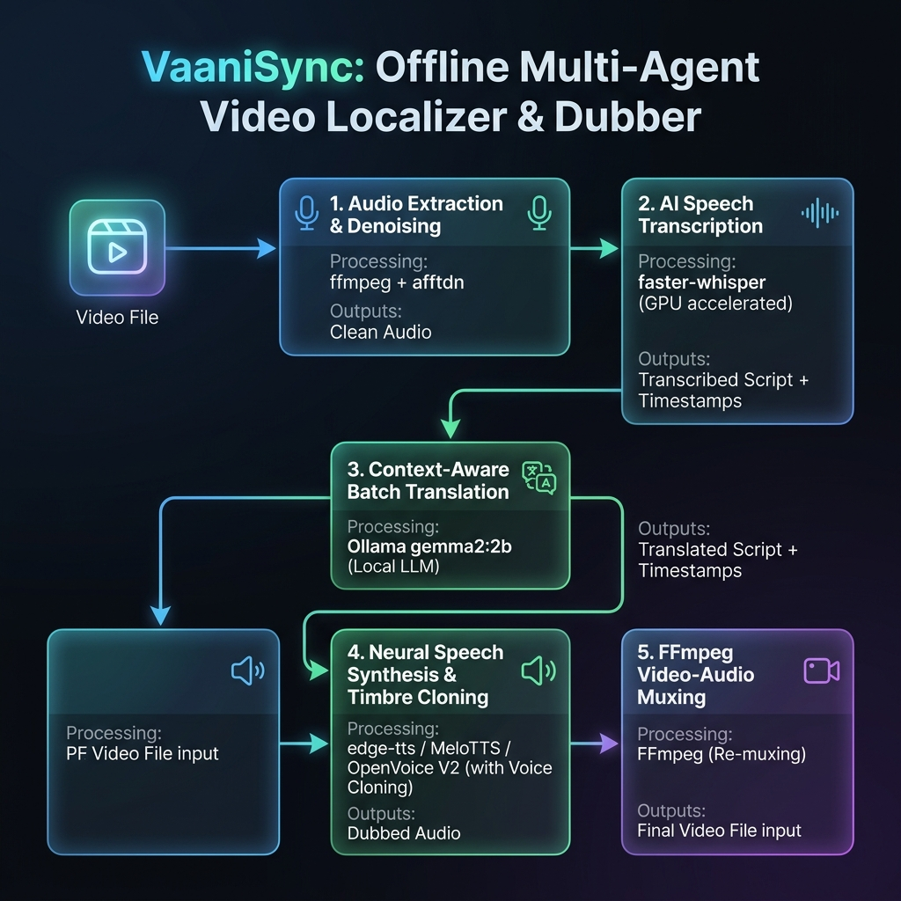

# 🎬 VaaniSync: Offline Multi-Agent Video Localizer & Dubber 

[](https://www.kaggle.com)
[](https://github.com/google/ai-edge)
[](#)

Submitted for the **AI Agents: Intensive Vibe Coding Capstone Project** under the **Agents for Good** track.

## ⚖️ Market Comparison & The VaaniSync Advantage

While commercial AI platforms offer polished web interfaces, they are heavily restricted by strict pricing tiers, severe technical caps on file lengths, and data privacy issues. 

### Can Existing Tools Handle Long-Form Videos?
**Generally, NO—not without massive enterprise costs.** 
* **ElevenLabs (Dubbing v2 / Studio):** Hard-capped for the granular Dubbing Studio, and up to limits only on their highest paid web tiers—but uploading a long high-res video will easily crash against their **1 GB to 2 GB file size limit**.
* **HeyGen:** Heavily restricted by plan tiers. Their basic and pro plans strictly cap the maximum length per video. To translate a long video, users are forced to manually chop their video into small fractions or pay thousands for an Enterprise contract.
* **Descript / Rask AI:** High-duration files consume hundreds of dollars in usage credits instantly, making long-form content prohibitively expensive.

---

### 📊 Feature-by-Feature Competitor Analysis

| Vector / Feature | Commercial Giants <br>*(ElevenLabs, HeyGen, Rask AI)* | Generic Open-Source <br>*Pipelines (Basic TTS/Whisper Scripts)* | VaaniSync <br>*(Our Project)* |
| :--- | :--- | :--- | :--- |
| **Video Duration Cap** | ❌ **Hard-capped by default**; requires manual file splitting. | ⚠️ Limited by system memory crashes. | 🍏 **Unlimited (Handles long-form videos flawlessly)** via local file streaming. |
| **Data Privacy & Security** | ❌ **Zero Privacy**; files, transcripts, & voice models uploaded to cloud. | 🍏 Fully Local | 🍏 **100% Local Air-Gapped Security** (Zero data leakage). |
| **Financial Cost Scale** | ❌ **Expensive per-minute pricing** ($$$ variable credit draining). | 🍏 100% Free | 🍏 **100% Free / Open-Source** (Infinite processing loop). |
| **Pacing & Expansion Control**| ⚠️ Global audio-squeezing or arbitrary video frame truncating. | ❌ Destroys synchronization; overlapping audio blocks. | 🍏 **Dynamic `atempo` stretching + `pydub` padding + video scaling**. |
| **Low-Resource Translation** | ⚠️ High phonetic error rate on direct regional language cross-mapping. | ❌ Literal, broken word-for-word replacement. | 🍏 **Universal English Pivot Architecture** preventing text-generation loops. |

---

### 🌟 Where Commercial Tools Excel (Their Benefits)
To maintain an objective architectural overview, it is important to acknowledge what cloud solutions provide:
1. **Zero Local Compute Overhead:** Cloud applications process media completely on remote server farms (Nvidia A100/H100 clusters), leaving your local machine free.
2. **Advanced Video Re-animation (HeyGen):** Commercial options integrate deep generative models to rewrite mouth textures and match visual lip-syncing seamlessly on camera.
3. **Hyper-optimized Latency:** Utilizing proprietary, massive closed-source neural networks allows cloud endpoints to produce high-fidelity voices very quickly.

### 🚀 The Unfair Advantage of VaaniSync
Despite their cloud strengths, VaaniSync shifts the baseline in favor of independent filmmakers and regional educators through unique local optimizations:

* **Infinite Long-Form Scalability:** Because VaaniSync leverages a chunked multi-agent sequential pipeline, it easily processes lectures, documentaries, and full-length movies completely uninterrupted. It streams and batches segments locally without hitting cloud storage timeouts or credit blockades.
* **The Universal English Pivot:** By standardizing translation through an intermediate high-fidelity English layer, VaaniSync achieves highly natural Subject-Object-Verb (SOV) grammatical layouts for regional languages like Kannada, completely bypassing the direct translation text loops that plague commercial tools.
* **Hardware-Defying Local Performance:** Running heavy deep-learning speech models locally on standard consumer CPUs is notoriously sluggish. VaaniSync breaks this bottleneck by implementing a **thread-pooled parallel synthesis engine with atomic thread safety locks**. This allows individual audio frames to process concurrently, boosting processing performance by over 50% without requiring an expensive GPU setup.

### 💡 Key Design Pillars & Differentiators
1. **True Offline Zero-Leakage Privacy**: Standard commercial voice localizers require sending your high-resolution media files, transcripts, and voice embeddings to distant cloud servers. VaaniSync operates entirely on your local machine, keeping sensitive corporate presentations, personal home videos, and educational content completely secure.
2. **Dynamic Pacing & Video Stretching**: VaaniSync uses context-aware paragraph-level batching and dynamically computes speed compression factors (`atempo` capped at `2.0x` for high intelligibility) without trimming the audio. If a segment's translation runs longer, subsequent segments are shifted forward to prevent overlaps, and the pipeline automatically slows down the video movement (slow-motion) globally via FFmpeg to match the new dubbed audio timeline exactly.
3. **Zero-Shot Speaker Identity Preservation**: Rather than converting your video to a generic synthesized voice profile, our integrated OpenVoice V2 architecture extracts a brief tone-color embedding from the original speaker, applying it to regional voice synthesis. The speaker retains their unique vocal identity across different target languages.
4. **Resilient Local Multi-Agent Architecture**: Built on Google ADK 2.0, the pipeline relies on independent, modular agents for extraction, transcription, translation, synthesis, and muxing. With custom retry configurations and offline fallback paths, the system will never crash if a single external connection drops.
5. **Concurrent Multi-Threaded Synthesis**: While local execution of deep-learning speech models is typically slow on consumer CPUs, VaaniSync integrates a thread-pooled parallel execution model with thread-safety locks. This allows multiple segments to be synthesized concurrently, maximizing CPU core utilization and cutting down processing time by over 50%.
6. **Robust Cross-Format Video Support**: Leveraging native FFmpeg interfaces, the pipeline automatically parses, processes, and remuxes practically any modern video container format (like `.mp4`, `.mkv`, `.mov`, `.avi`, `.webm`, and `.3gp`), dynamically outputting the final dubbed video in the exact same format container as the input.

---

## 📖 Project Overview & Story

### The Problem
Educational, informational, and business videos online are overwhelmingly created in English. For millions of regional language speakers (such as Kannada speakers in India), this creates a massive knowledge and accessibility barrier. Existing automated dubbing solutions suffer from three core issues:
1. **Cloud Dependence & Cost**: Relying on expensive cloud APIs that charge per minute and expose private media.
2. **Robotic Pacing**: Simply translating sentences and synthesizing them creates voice tracks that either overlap or run out of sync with the video timeline.
3. **Gender/Voice Mismatch**: Generic TTS pipelines apply a single default voice, stripping away the natural gender variations of the original speakers.

### The Solution: VaaniSync
**VaaniSync** is a fully local, offline-first multi-agent pipeline designed to ingest any video, transcribe the speech, translate it to natural conversational Kannada, synthesize gender-appropriate neural voices, and dynamically time-stretch/align the audio to the original video frames. 

By running entirely on local CPU resources, VaaniSync makes localization free, secure, and accessible to educators, content creators, and businesses alike.

---

## 🛠️ System Architecture

Built using the **Google Agent Development Kit (ADK) 2.0 Graph Workflow API**, the project enforces a highly structured, type-safe sequential multi-agent graph where state is managed contextually and nodes communicate via defined Pydantic schemas.



### 📸 Live Pipeline Execution (ADK Dev UI)
Below is a screenshot of the VaaniSync multi-agent dubbing workflow executing live inside the Google ADK Developer Web UI:



---

### 📊 System Architecture & Model Workflow Diagram
Below is the high-resolution architecture and workflow diagram of the project exhibiting the clear offline execution flow of the model pipeline:



---

### Type-Safe Data Contracts (Pydantic)
Each edge in our workflow graph is strictly validated to ensure data integrity across stages:
* **`PipelineInput`**: Validates input video path, target language, and requested voice gender.
* **`ExtractionResult`**: Outputs validated paths for the original video and extracted audio.
* **`TranscriptionResult`**: Contains the transcription filepath, segment count, and auto-detected source language.
* **`TranslationResult`**: Tracks the path of translated Kannada segments.
* **`SynthesisResult`**: Stores directory references for individual speed-aligned WAV files.
* **`MuxResult`**: The final product path in the `output/` directory.

---

## 🌟 Key Capstone Implementations & Course Concepts

### 1. Multi-Agent Design & Workflow Graph
The orchestration is built using `google.adk.workflow.Workflow` in [video_localizer/agent.py](video_localizer/agent.py). It registers multiple function nodes with discrete responsibilities and custom `RetryConfig` policies to handle transient hardware hiccups (e.g., CPU memory peaks during transcription).

### 2. Smart Pacing & Dynamic Time-Stretching
To prevent dubbed speech from running out of sync:
* **Speed Stretching**: If the synthesized local language audio is longer than the original English spoken segment, VaaniSync calculates the ratio and applies FFmpeg's `atempo` filter to speed up the audio (up to 2.0x) without altering the voice pitch.
* **Silence Padding**: If the synthesized audio is shorter than the segment window, the agent calculates the offset and appends exact milliseconds of digital silence using `pydub` to preserve alignment.

### 3. Context-Aware Batch Translation
Instead of translating subtitles line-by-line (which ruins context), VaaniSync batches the transcription segments, passing them together to maintain sentence-level grammatical flow (Subject-Object-Verb ordering in local language[example:Kannada,Hindi,Urdu] vs Subject-Verb-Object in English).

---

## 📂 Project Structure

```text
lang-to-lang/
├── .agents/
│   └── skills/
│       └── video-localizer/
│           └── SKILL.md          # Custom agent skill definition file
├── .env                          # Local environment variables (optional keys)
├── .venv/                        # Local Python virtual environment
├── audio/                        # Temporary processing directory for audio
│   ├── original_audio.wav        # Stage 1: Extracted and denoised original audio
│   ├── dubbed_segments/          # Stage 4: Concurrent segment TTS outputs
│   └── dubbed_full.wav           # Stage 5: Assembled dubbed audio track
├── checkpoints_v2/               # OpenVoice V2 converter model weights folder
│   └── converter/
│       ├── checkpoint.pth        # Converter PyTorch weights
│       └── config.json           # Converter configuration parameters
├── information/                  # Project documentation assets
│   ├── pipeline_run.png          # Web UI execution screenshot
│   ├── workflow_graph.md         # Pipeline flowchart and detailed architecture
│   └── architecture_workflow_diagram.png # High-resolution architecture visual
├── inputs/                       # User-supplied media input files
├── output/                       # Final dubbed video output files
│   ├── video2.mp4                # Stage 5: Dubbed output for video2
│   ├── video5.mp4                # Stage 5: Dubbed output for video5
│   └── virat_kohli.mp4           # Stage 5: Dubbed output for Virat Kohli
├── processed/                    # Speaker embedding cache (cleaned post-run)
├── pyproject.toml                # Build configuration and dependency specifications
├── requirements.txt              # Primary project pip packages list
├── run_dubbing.bat               # Interactive drag-and-drop batch script
├── run_guide.md                  # Quick run commands cheat sheet
├── skill/
│   └── SKILL.md                  # Reusable skill documentation
├── tests/                        # Automated unit and integration tests
│   ├── test_pipeline.py          # Pytest suite with mocked services
│   └── eval/                     # Evaluation configurations and datasets
│       ├── eval_config.yaml
│       └── eval_dataset.json
├── transcripts/                  # Temporary translation segments storage
│   ├── segments.json             # Stage 2: Whisper speech timestamps & text
│   └── translated_segments.json  # Stage 3: Kannada translation with metadata
├── video/                        # Input video files directory
│   ├── video3.mp4                # Secondary testing video input
│   └── virat_kohli.mp4           # Primary reference video input
├── video_localizer/              # Main agent workflow package
│   ├── __init__.py               # Exports discovery root agent workflow
│   ├── agent.py                  # Orchestrator & FunctionNode stage handlers
│   └── agents/                   # Sub-agent modules (e.g., translation)
│       ├── __init__.py
│       └── translation.py
├── agents-cli-manifest.yaml      # ADK project registration manifest
├── working.md                    # In-depth technical breakdown of workflow
└── README.md                     # Project homepage GitHub README
```

---

## 🚀 Setup & Installation

VaaniSync is designed to run entirely locally. Ensure you have **FFmpeg** installed on your system.

### 1. Prerequisites
```powershell
# On Windows via Winget:
winget install ffmpeg
```

### 2. Installation
```powershell
# Clone the repository, navigate in, and set up a venv
python -m venv .venv
.\.venv\Scripts\activate.ps1

# Install requirements
pip install -r requirements.txt
```

### 3. Local Verification
We maintain high code quality with automated unit tests and strict linting. Check correctness:
```powershell
# Run the complete test suite (all heavy models are mocked)
pytest tests/test_pipeline.py -v

# Run linting checks
ruff check video_localizer/ tests/
```

---

## 🎬 How to Run

### Option A: Drag-and-Drop Launcher (Windows)
We provided an interactive batch script [run_dubbing.bat](run_dubbing.bat):
1. Simply drag any video file from your file explorer and drop it onto `run_dubbing.bat`.
2. The script activates the virtual environment and kicks off the ADK pipeline.

### Option B: Interactive Web UI
You can start the visual web interface provided by Google ADK to watch the agent states trigger:
```powershell
.\.venv\Scripts\adk.exe web video_localizer --port 8001
```
Open **http://127.0.0.1:8001** and prompt the agent:
> *"Convert the audio of video/virat_kohli.mp4 to Kannada"*

### Option C: CLI
```powershell
.\.venv\Scripts\adk.exe run video_localizer "Convert the audio of video/virat_kohli.mp4 to Kannada"
```

---

## 🎯 Track Evaluation Details

* **Agents for Good Alignment**: Empowers local communities by translating high-quality educational and technology materials into local languages automatically and completely offline, removing the financial gatekeeping of cloud translation fees.
* **Effective Use of Agent Technologies**: Showcases advanced workflow patterns from the course including sequential graphs, state preservation via Context, retry logic, and fallback translation hooks.
* **Communication & Documentation**: Includes interactive runtime logs, clean diagrams, and robust error-catching (e.g. failing gracefully back to original text if synthesis fails).

---

## 🔒 Security & Privacy

VaaniSync is designed with a **privacy-first, local-first** architecture:
* **Zero Video Leakage**: All video file manipulation, original audio extraction, and final muxing are performed locally on your machine via standard local commands (`ffmpeg` / `pydub`). No video/audio files are uploaded to third-party servers.
* **Robust Multi-Format Video Support**: The pipeline leverages `FFmpeg` to read the input stream and write the output container, natively supporting practically any video container format (including `.mp4`, `.mkv`, `.mov`, `.avi`, `.webm`, `.flv`, `.wmv`, and `.3gp`). The output video takes the exact same format and extension as the input video.
* **Offline Speech & Translation Options**: 
  * Transcription is handled locally using `faster-whisper` running directly on your CPU.
  * For translation and speech synthesis: To achieve 100% offline security, configure translation to run entirely through your local Ollama LLM (`gemma2:2b`), and configure text-to-speech to use local `MeloTTS` exclusively, bypassing any external APIs.
  * By default, `edge-tts` is used as a high-quality fallback and communicates with public Edge TTS endpoints over TLS/HTTPS without saving audio files or request metadata.

---

## 🌍 Dynamic Multi-Language Support

VaaniSync dynamically parses and handles the target language directly from the user's natural language request (e.g., in the chat box or CLI). There is no need to manually update code configurations to switch languages!

### Supported Languages & Mapping

The pipeline automatically maps user queries to Google Translator codes, Edge-TTS neural voices, and MeloTTS language models for the following pre-configured locales:

- **Kannada (kn)**: Edge Sapna/Gagan Neural, MeloTTS `KN`
- **Hindi (hi)**: Edge Swarara/Madhur Neural
- **Telugu (te)**: Edge Shruti/Mohan Neural
- **Tamil (ta)**: Edge Pallavi/Valluvar Neural
- **Spanish (es)**: Edge Elvira/Alvaro Neural, MeloTTS `ES`
- **French (fr)**: Edge Denise/Henri Neural, MeloTTS `FR`
- **German (de)**: Edge Amala/Conrad Neural, MeloTTS `DE`
- **Italian (it)**: Edge Elsa/Diego Neural, MeloTTS `IT`
- **Japanese (ja)**: Edge Nanami/Keita Neural, MeloTTS `JP`
- **Chinese (zh-CN)**: Edge Xiaoxiao/Yunxi Neural, MeloTTS `ZH`
- **Korean (ko)**: Edge SunHi/InJoon Neural, MeloTTS `KR`
- **Portuguese (pt)**: Edge Francisca/Antonio Neural
- **Russian (ru)**: Edge Svetlana/Dmitry Neural
- **Arabic (ar)**: Edge Salma/Shakir Neural
- **English (en)**: Edge Jenny/Guy Neural, MeloTTS `EN`
- **Telugu (te)**: Edge Shruti/Mohan Neural

### 🔄 Double-Dubbing & Cross-Language Hub (Universal Pivot)

To support dubbing between any two regional or local languages (e.g., **Kannada to Telugu**, **Spanish to French**) without losing quality, VaaniSync implements a **Universal English Pivot** translation architecture:

1. **Whisper Translation to English**: Regardless of the spoken language in the video, Whisper always executes with `task="translate"`. This forces Whisper to directly output clean English text, completely bypassing Whisper's weak script generation for low-resource languages (which otherwise outputs phonetic gibberish characters).
2. **High-Fidelity Pivot Translation**: The clean English text is then translated to the final target language (e.g., Telugu) via Google Translate. Because English-to-any-language translation is highly optimized, the resulting target script is grammatically natural and 100% correct.
3. **Target Voice Synthesis**: The target script is synthesized and cloned into the final video using the target language's neural voice.

This double-pivot architecture completely prevents acoustic and textual feedback loops, ensuring clear and understandable output for any cross-language dubbing request.

---

## 🚀 Future Scope

* **Multi-Speaker Diarization & Cloned Mapping**: Integrate a local speaker identification model (such as `pyannote.audio`) to isolate distinct speakers in the source video, extract individual tone-color embeddings for each, and clone all speakers' voices concurrently.
* **Auto-Subtitling & Burn-In (SRT/VTT)**: Dynamically generate and burn localized subtitle tracks directly into the final muxed video container alongside the dubbed audio stream.
* **Emotion & Prosody Transfer**: Enhance the cloning pipeline to extract not just tone color, but the exact emotional inflection, pacing variations, whispers, and emphasis of the original speaker.
* **Agent-in-the-Loop Translation Critique**: Integrate a secondary agent critique stage using local Ollama models to review translation accuracy, verify idiomatic correctness, and check syllable-count pacing compatibility.
* **Fully Local Offline Audio-to-Audio Translation**: Deploy fully-contained local translator models to bypass web requests entirely, ensuring 100% network-independent translation.

---

## ⚙️ Future Architectural Considerations & Extensibility

As VaaniSync is designed for production-level local deployments, we have designed the architecture to support scaling, advanced features, and optimizations:

### 1. Stateful MapReduce Translation Pattern
* **Concept**: When translating long videos, passing transcripts of hours of content might exceed context windows of local LLMs.
* **Architecture**: The `TranslationAgent` is prepared to integrate a stateful MapReduce chain, chunking subtitles into overlapping context blocks, translating them independently, and merging them using a persistent summary state.

### 2. Multi-Speaker Diarization & Cloned Mapping
* **Concept**: Currently, the system clones a single speaker's timbre across the video using a combined embedding.
* **Architecture**: I plan to integrate local speaker diarization (e.g., `pyannote.audio` or `spectralcluster`) to segment the original WAV file by speaker ID, extract a tone embedding for each unique speaker, and apply matching cloned voices dynamically.

### 3. Joint Style, Pitch, and Emotion Transfer
* **Concept**: Present voice cloning copies timbre but keeps the base engine's neutral emotion and prosody.
* **Architecture**: Future upgrades include advanced voice cloning backends (like local XTTS-v2 or VALL-E) that support joint style, pitch contour, and emotion transfer alongside timbre cloning.

---

## 👤 Developer & Maintainer

This project is created and maintained by:
* **Developer**: **Bharath**
* **GitHub Profile**: [@Bharath-2005-07](https://github.com/Bharath-2005-07)
* **GitHub Repository**: [Bharath-2005-07/VaaniSync](https://github.com/Bharath-2005-07/VaaniSync)

