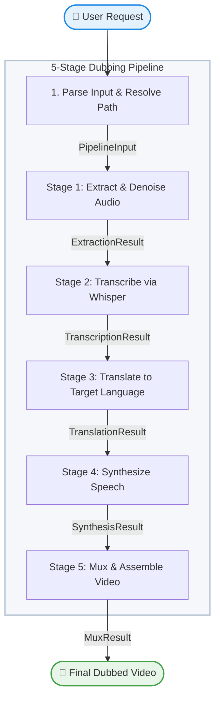

# 🎬 Video Localizer — Workflow Graph

This document details the 5-stage sequential pipeline designed for local video localization and dubbing into any dynamically requested target language (like Spanish, French, Kannada, Hindi, Telugu, German, etc.).

---

## 🛠️ Pipeline Flowchart



---

## 📂 Project Structure

```text
lang-to-lang/
├── .agents/
│   └── skills/
│       └── video-localizer/
│           └── SKILL.md          # Custom agent skill definition file
├── .venv/                        # Local Python virtual environment
├── audio/                        # Temporary processing directory for audio
│   ├── original_audio.wav        # Stage 1: Extracted and denoised original audio
│   ├── dubbed_segments/          # Stage 4: Concurrent segment TTS outputs
│   └── dubbed_full.wav           # Stage 5: Assembled dubbed audio track
├── checkpoints_v2/               # OpenVoice V2 converter model weights folder
│   └── converter/
│       ├── checkpoint.pth        # Converter PyTorch weights
│       └── config.json           # Converter configuration parameters
├── information/                  # Project documentation assets
│   ├── pipeline_run.png          # Web UI execution screenshot
│   └── workflow_graph.md         # Pipeline flowchart and architecture
├── inputs/                       # User-supplied media input files
├── output/                       # Final dubbed Kannada video output files
│   └── virat_kohli.mp4           # Stage 5: Dubbed output multiplexed video
├── processed/                    # Speaker embedding cache created by OpenVoice
├── processing/                   # Temporary cache directory for processing
├── skill/
│   └── SKILL.md                  # Reusable skill documentation
├── tests/                        # Automated unit and integration tests
│   ├── test_pipeline.py          # Pytest suite with mocked services
│   └── eval/                     # Evaluation configurations and datasets
│       ├── eval_config.yaml
│       └── eval_dataset.json
├── transcripts/                  # Temporary translation segments storage
│   ├── segments.json             # Stage 2: Whisper speech timestamps & text
│   └── translated_segments.json  # Stage 3: Kannada translation with metadata
├── video/                        # Input video files directory
│   ├── video2.mp4                # Secondary testing video input
│   ├── video3.mp4                # Tertiary testing video input
│   └── virat_kohli.mp4           # Reference test video input
├── video_localizer/              # Main agent workflow package
│   ├── __init__.py               # Exports discovery root agent workflow
│   ├── agent.py                  # Orchestrator & FunctionNode stage handlers
│   └── agents/                   # Sub-agent modules (e.g., translation)
│       ├── __init__.py
│       └── translation.py
├── agents-cli-manifest.yaml      # ADK project registration manifest
├── pyproject.toml                # Build configuration and dependency specifications
├── requirements.txt              # Primary project pip packages list
├── run_dubbing.bat               # Interactive drag-and-drop batch script
├── run_guide.md                  # Quick run commands cheat sheet
├── CAPSTONE_README.md            # Kaggle Capstone documentation README
└── README.md                     # Project homepage GitHub README
```

---

## 🚀 Setup & Verification

Follow these steps to run the pipeline locally:

### 1. Prerequisite Installations
* **FFmpeg**: Must be installed and added to your system's PATH.
  ```powershell
  winget install ffmpeg
  ```
* **Ollama**: Download and install Ollama from [ollama.com](https://ollama.com). Pull the recommended model:
  ```powershell
  ollama pull gemma2:2b
  ```

### 2. Environment Activation
```powershell
# Create & activate a virtual environment
python -m venv .venv
.\.venv\Scripts\Activate.ps1

# Install requirements
pip install -r requirements.txt
```

### 3. Run Pipeline
Choose one of the three options:
* **Interactive script**: Drag and drop any video onto `run_dubbing.bat` or double-click it.
* **ADK Web UI**:
  ```powershell
  adk web video_localizer --port 8001
  ```
* **ADK CLI**:
  ```powershell
  adk run video_localizer "Convert the audio of video/video1.mp4 to Spanish"
  ```
