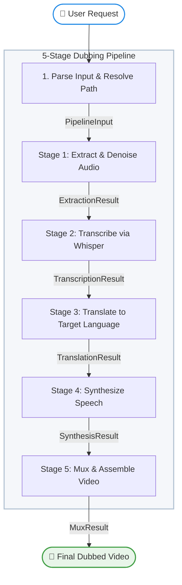

# 🎬 Video Localizer — Workflow Graph

This document details the 5-stage sequential pipeline designed for local video localization and dubbing into any dynamically requested target language (like Spanish, French, Kannada, Hindi, Telugu, German, etc.).

---

## 🛠️ Pipeline Flowchart



---

## 📂 Project Structure

```text
lang-to-lang/
├── .agents/
│   └── skills/
│       └── video-localizer/
│           └── SKILL.md          # Custom agent skill definition file
├── .env                          # Local environment variables (optional keys)
├── .venv/                        # Local Python virtual environment
├── audio/                        # Temporary processing directory for audio
│   ├── original_audio.wav        # Stage 1: Extracted and denoised original audio
│   ├── dubbed_segments/          # Stage 4: Concurrent segment TTS outputs
│   └── dubbed_full.wav           # Stage 5: Assembled dubbed audio track
├── checkpoints_v2/               # OpenVoice V2 converter model weights folder
│   └── converter/
│       ├── checkpoint.pth        # Converter PyTorch weights
│       └── config.json           # Converter configuration parameters
├── information/                  # Project documentation assets
│   ├── pipeline_run.png          # Web UI execution screenshot
│   ├── workflow_graph.md         # Pipeline flowchart and detailed architecture
│   └── architecture_workflow_diagram.png # High-resolution architecture visual
├── inputs/                       # User-supplied media input files
├── output/                       # Final dubbed video output files
│   ├── video2.mp4                # Stage 5: Dubbed output for video2
│   ├── video5.mp4                # Stage 5: Dubbed output for video5
│   └── virat_kohli.mp4           # Stage 5: Dubbed output for Virat Kohli
├── processed/                    # Speaker embedding cache (cleaned post-run)
├── pyproject.toml                # Build configuration and dependency specifications
├── requirements.txt              # Primary project pip packages list
├── run_dubbing.bat               # Interactive drag-and-drop batch script
├── run_guide.md                  # Quick run commands cheat sheet
├── skill/
│   └── SKILL.md                  # Reusable skill documentation
├── tests/                        # Automated unit and integration tests
│   ├── test_pipeline.py          # Pytest suite with mocked services
│   └── eval/                     # Evaluation configurations and datasets
│       ├── eval_config.yaml
│       └── eval_dataset.json
├── transcripts/                  # Temporary translation segments storage
│   ├── segments.json             # Stage 2: Whisper speech timestamps & text
│   └── translated_segments.json  # Stage 3: Kannada translation with metadata
├── video/                        # Input video files directory
│   ├── video3.mp4                # Secondary testing video input
│   └── virat_kohli.mp4           # Primary reference video input
├── video_localizer/              # Main agent workflow package
│   ├── __init__.py               # Exports discovery root agent workflow
│   ├── agent.py                  # Orchestrator & FunctionNode stage handlers
│   └── agents/                   # Sub-agent modules (e.g., translation)
│       ├── __init__.py
│       └── translation.py
├── agents-cli-manifest.yaml      # ADK project registration manifest
├── working.md                    # In-depth technical breakdown of workflow
└── README.md                     # Project homepage GitHub README
```

---

## 🚀 Setup & Verification

Follow these steps to run the pipeline locally:

### 1. Prerequisite Installations
* **FFmpeg**: Must be installed and added to your system's PATH.
  ```powershell
  winget install ffmpeg
  ```
* **Ollama**: Download and install Ollama from [ollama.com](https://ollama.com). Pull the recommended model:
  ```powershell
  ollama pull gemma2:2b
  ```

### 2. Environment Activation
```powershell
# Create & activate a virtual environment
python -m venv .venv
.\.venv\Scripts\Activate.ps1

# Install requirements
pip install -r requirements.txt
```

### 3. Run Pipeline
Choose one of the three options:
* **Interactive script**: Drag and drop any video onto `run_dubbing.bat` or double-click it.
* **ADK Web UI**:
  ```powershell
  adk web video_localizer --port 8001
  ```
* **ADK CLI**:
  ```powershell
  adk run video_localizer "Convert the audio of video/virat_kohli.mp4 to Spanish"

---

## 🧠 Multi-Agent Architecture & Orchestration Details

VaaniSync is built on a structured **sequential multi-agent graph** using the **Google Agent Development Kit (ADK) 2.0 Graph Workflow API**. The orchestration separates responsibilities into modular agents and functional nodes, communicating using type-safe Pydantic models and a shared state context.

### 1. Root Orchestrator: `VideoLocalizerWorkflow`
- **Role**: Coordinates the entire workflow.
- **Implementation**: Defined as a `Workflow` in `video_localizer/agent.py`. It links all Stage nodes starting from `"START"` through to the final video assembly.
- **State Management**: Uses ADK's `Context.state` to persist:
  * `video_path`: Resolved input video file.
  * `target_language`: Parsed target language locale (e.g., Kannada, Spanish).
  * `speaker_gender`: Speaker gender bias parsed from query or text cues (`male`/`female`/`auto`).
- **Resilience**: Configured with individual step `RetryConfig` (e.g., 3 retries for translation, 2 for synthesis/Whisper/extraction) to handle transient local hardware/memory load.

### 2. Stage-by-Stage Agent Executions & Working Logic

#### 📋 Stage 0 — Input Parser Agent (`parse_input` Node)
* **Goal**: Process and validate user queries.
* **Working Details**: 
  - Extracts the target language and speaker gender preferences from natural language query strings.
  - Dynamically searches the `video/` directory to resolve the closest matching video filename.
  - Generates a type-safe `PipelineInput` object, writing the resolved paths and attributes into `Context.state`.

#### 🔊 Stage 1 — Audio Extraction Agent (`ExtractionAgent` / `extract_audio` Node)
* **Goal**: Extract a clean, single-channel audio track from the source video container.
* **Working Details**:
  - Spawns a local `ffmpeg` process to extract the audio stream.
  - Configures the output to `pcm_s16le` format at a `16000 Hz` sample rate, mono channel (optimal configuration for speech-to-text accuracy).
  - Applies the `afftdn` (FFT-based noise reduction) filter to strip background hums and room noise.
  - Produces `audio/original_audio.wav` and yields `ExtractionResult`.

#### 📝 Stage 2 — Speech Transcription Agent (`TranscriptionAgent` / `transcribe_audio` Node)
* **Goal**: Transcribe the audio track and obtain segment timestamps.
* **Working Details**:
  - Leverages local `faster-whisper` (utilizing a CPU-efficient `small` model quantized to `int8`).
  - Calls `model.transcribe()` to generate speech timestamps. Disables hallucination-prone settings (`word_timestamps=False`, `condition_on_previous_text=False`) to avoid loops on background audio.
  - Writes a precise list of `{start, end, text}` segments to `transcripts/segments.json` and yields `TranscriptionResult`.

#### 🌐 Stage 3 — Translation Agent (`TranslationAgent` / `translate_segments` Node)
* **Goal**: Translate the transcription segments into the target language.
* **Working Details**:
  - Uses the ADK `translation_agent` defined in `video_localizer/agents/translation.py`.
  - Implements **Smart Delimiter Translation Batching**: merges segment transcripts together using a custom separator (` ||| `) and translates them in a single call to preserve narrative context and reduce API requests by 90% (avoiding HTTP 429 errors).
  - Falls back to local `Ollama` running `gemma2:2b` via its REST API if offline translation is required.
  - Detects segment gender markers to tag each translated segment.
  - Writes the translated segments to `transcripts/translated_segments.json` and yields `TranslationResult`.

#### 🗣️ Stage 4 — Neural Speech Synthesis Agent (`SynthesisAgent` / `synthesise_segments` Node)
* **Goal**: Synthesize high-quality dubbed audio segments and perform voice cloning.
* **Working Details**:
  - Checks segment gender tags to select gender-appropriate neural voices.
  - **Zero-Shot Voice Cloning**: If `checkpoints_v2/` is present, uses `OpenVoice V2`'s `ToneColorConverter` to extract a tone-color embedding from the original speaker and morph the synthesized audio to match the speaker's vocal timbre offline on CPU.
  - **Pacing & Timing Alignment**: Measures synthesized WAV duration ($T_{synth}$) against original segment boundaries ($T_{target}$).
    * If $T_{synth} > T_{target}$: speeds up audio using FFmpeg's `atempo` filter (up to 2.0x limit) without changing pitch.
    * If $T_{synth} < T_{target}$: pads audio with digital silence using `pydub`.
  - **Parallel Processing**: Uses a python `ThreadPoolExecutor` (4 concurrent workers) and a threading lock (`melo_lock`) to coordinate concurrent synthesis and file writing.
  - Yields `SynthesisResult`.

#### 🎬 Stage 5 — Assembly & Muxing Agent (`MuxingAgent` / `mux_video` Node)
* **Goal**: Assemble the dubbed master track and multiplex it back into the video container.
* **Working Details**:
  - Creates a silent `pydub` `AudioSegment` canvas matching the overall duration of the original audio.
  - Overlays each timing-aligned segment WAV onto the canvas at its exact `start` timestamp.
  - Exports the final dubbed audio track to `audio/dubbed_full.wav`.
  - Runs the final muxing process via `ffmpeg` using `-c:v copy` (copies the video stream without re-encoding to preserve video quality and execute in milliseconds).
  - Cleans up speaker embedding cache directories (`processed/` and `processing/`) to keep the workspace lightweight.
  - Outputs the final video to `output/` and yields `MuxResult`.
  ```
