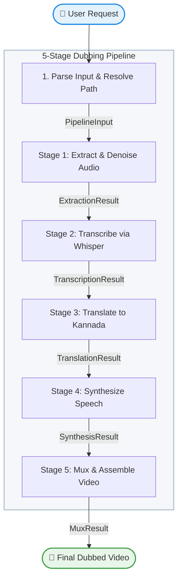

# 🎬 Video Localizer — Workflow Graph

This document details the 5-stage sequential pipeline designed for local video localization and dubbing into Kannada.

---

## 🛠️ Pipeline Flowchart



---

## 📂 Project Structure

```text
lang-to-lang/
├── information/
│   └── workflow_graph.md         # This pipeline flowchart & documentation
├── skill/
│   └── SKILL.md                  # Custom ADK agent skill definition
├── video/
│   └── video1.mp4                # Input video (default placeholder)
├── audio/
│   ├── original_audio.wav        # Stage 1: Extracted original audio
│   ├── dubbed_segments/          # Stage 4: Individual translated speech WAV files
│   └── dubbed_full.wav           # Stage 5: Assembled dubbed audio track
├── transcripts/
│   ├── segments.json             # Stage 2: Whisper transcription segments
│   └── translated_segments.json  # Stage 3: Kannada translated text and metadata
├── output/
│   └── [input_filename].mp4      # Stage 5: Final Kannada dubbed video output
├── video_localizer/
│   ├── __init__.py
│   ├── agent.py                  # Main ADK workflow definition & node handlers
│   └── agents/
│       ├── __init__.py
│       └── translation.py        # Independent translation agent module
├── tests/
│   ├── test_pipeline.py          # Pytest automation suite
│   └── eval/
│       ├── eval_config.yaml
│       └── eval_dataset.json
├── requirements.txt              # Pipeline Python dependencies
└── run_dubbing.bat               # Interactive drag-and-drop batch script
```

---

## 🚀 Setup & Verification

Follow these steps to run the pipeline locally:

### 1. Prerequisite Installations
* **FFmpeg**: Must be installed and added to your system's PATH.
  ```powershell
  winget install ffmpeg
  ```
* **Ollama**: Download and install Ollama from [ollama.com](https://ollama.com). Pull the recommended model:
  ```powershell
  ollama pull gemma2:2b
  ```

### 2. Environment Activation
```powershell
# Create & activate a virtual environment
python -m venv .venv
.\.venv\Scripts\Activate.ps1

# Install requirements
pip install -r requirements.txt
```

### 3. Run Pipeline
Choose one of the three options:
* **Interactive script**: Drag and drop any video onto `run_dubbing.bat` or double-click it.
* **ADK Web UI**:
  ```powershell
  adk web video_localizer --port 8001
  ```
* **ADK CLI**:
  ```powershell
  adk run video_localizer "Convert the audio of video/video1.mp4 to Kannada"
  ```
