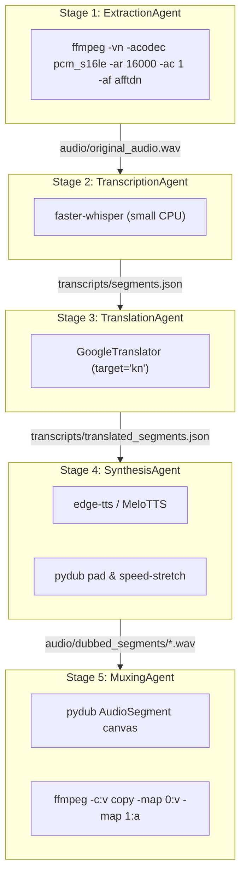

# ⚙️ VaaniSync: How it Works Under the Hood

This document provides a detailed technical breakdown of the architecture, workflow state management, tool configurations, and agent behaviors implemented in VaaniSync.

---

## 🧠 Workflow State & Orchestrator Design

VaaniSync is orchestrated using the **Google Agent Development Kit (ADK) 2.0 Graph Workflow API**. The orchestrator manages the pipeline by passing a shared `Context` object through a sequential sequence of `FunctionNode` edge steps.

### Shared State Variables (Stored in `Context.state`)
* `video_path`: Resolves the absolute or relative path to the input video.
* `target_language`: Specifies the target locale (defaults to `"Kannada"`).
* `speaker_gender`: Stores speaker gender cues (`"male"`, `"female"`, or `"auto"`).

---

## 🚀 Stage-by-Stage Technical Walkthrough



### Stage 1: ExtractionAgent
* **Input**: Original video file.
* **Operation**: Rips the audio track from the video and prepares it for speech-to-text.
* **FFmpeg Command**:
  ```bash
  ffmpeg -y -i input.mp4 -vn -acodec pcm_s16le -ar 16000 -ac 1 -af afftdn audio/original_audio.wav
  ```
* **Parameters explained**:
  * `-vn`: Disables video recording to save processing power.
  * `-acodec pcm_s16le`: Outputs raw, uncompressed 16-bit little-endian PCM audio.
  * `-ar 16000`: Resamples the audio to 16,000 Hz, which is the optimal sample rate for Whisper models.
  * `-ac 1`: Converts stereo audio to mono, decreasing channel processing time.
  * `-af afftdn`: Applies FFmpeg’s FFT-based noise reduction filter to remove background static, hums, and hiss.

---

### Stage 2: TranscriptionAgent
* **Input**: `audio/original_audio.wav`
* **Operation**: Detects speech intervals and generates raw transcripts.
* **Technology**: Local **`faster-whisper`** (running `small` model quantized to `int8` for fast CPU execution).
* **Under the hood**:
  * Calls `model.transcribe()` with `beam_size=5` to optimize search accuracy.
  * The transcription output produces timestamped intervals. Each segment returns a `start` time, `end` time, and the transcribed `text` string, which is written to [transcripts/segments.json](transcripts/segments.json).

---

### Stage 3: TranslationAgent
* **Input**: [transcripts/segments.json](transcripts/segments.json)
* **Operation**: Translates transcripts to Kannada while preserving start and end timestamps.
* **Technology**: `deep-translator` (Google Translate web endpoint wrapper) with local Ollama (`gemma2:2b`) fallback.
* **Under the hood**:
  * Scans segments for gender markers (e.g. pronouns like *he*, *she*, *him*, *her*) using a heuristic keyword filter to tag segments with gender metadata.
  * Passes text segments through the translation engine with the target set to `"kn"` (Kannada).
  * Writes the resulting map back to [transcripts/translated_segments.json](transcripts/translated_segments.json).

---

### Stage 4: SynthesisAgent
* **Input**: [transcripts/translated_segments.json](transcripts/translated_segments.json)
* **Operation**: Generates dubbed voice lines matching the original segment durations.
* **Technology**: `edge-tts` (Microsoft Neural Voices) & local `MeloTTS` (CPU version).
* **Under the hood**:
  * Checks segment gender tags to select either male (`kn-IN-GaganNeural`) or female (`kn-IN-SapnaNeural`) voices.
  * Generates audio for each individual segment.
  * **Synchronization Control**:
    * Measures duration of synthesized WAV ($T_{synth}$) vs original segment window ($T_{target}$).
    * If the audio is too long ($T_{synth} > T_{target}$): Chains FFmpeg `atempo` filters to speed up the playback (up to 2.0x limit) without changing the speaker's voice pitch:
      ```bash
      ffmpeg -i segment.wav -filter:a atempo=1.15 segment_sped.wav
      ```
    * If the audio is too short ($T_{synth} < T_{target}$): Appends digital silence of size ($T_{target} - T_{synth}$) using `pydub` to pad the segment, ensuring it lines up exactly with the video timeline.

---

### Stage 5: MuxingAgent
* **Input**: Generated WAV files in `audio/dubbed_segments/` and the original video.
* **Operation**: Assembles a master audio track and merges it back into the video file.
* **Technology**: `pydub.AudioSegment` and `FFmpeg` command line.
* **Under the hood**:
  * Creates an empty, silent `AudioSegment` canvas matching the overall duration of the original audio.
  * Overlays each synchronized dubbed segment onto the silent canvas at its specified `start` timestamp.
  * Exports the complete track to `audio/dubbed_full.wav`.
  * Runs the final multiplexing (`mux`) command:
    ```bash
    ffmpeg -y -i video.mp4 -i audio/dubbed_full.wav -c:v copy -map 0:v:0 -map 1:a:0 output/video.mp4
    ```
  * `-c:v copy`: Copies the video stream directly without re-encoding, avoiding quality degradation and finishing the muxing step in milliseconds.

---

## 🛠️ Tool & Library Matrix

| Tool / Library | Role in Pipeline | Offline Capability |
|---|---|---|
| **FFmpeg** | Denoising (`afftdn`), Speed stretching (`atempo`), and video-audio merging (`muxing`). | 100% Offline (Local binary) |
| **faster-whisper** | CPU-efficient speech-to-text with timestamping. | 100% Offline (Local execution) |
| **deep-translator** | High-fidelity translation from any detected language to Kannada. | Online (Uses free Google Translate web endpoint) |
| **Ollama** | Local LLM fallback for translation. | 100% Offline (Runs local server on port 11434) |
| **edge-tts** | Generates highly natural gender-matched neural voices. | Online (HTTPS requests to TLS Edge endpoints) |
| **MeloTTS** | Offline Kannada voice generation engine. | 100% Offline (Runs locally on CPU) |
| **pydub** | Frame-accurate audio slicing, stitching, and silence padding. | 100% Offline (Local Python library) |
